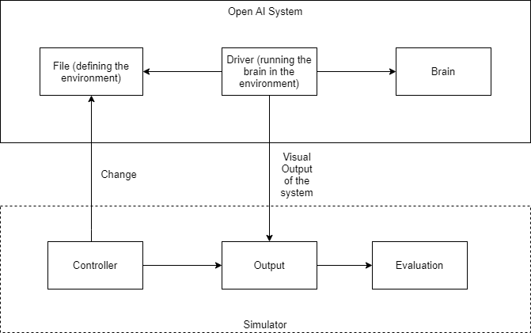

## <div align="center">**MUTATION TESTING OF REINFORCEMENT LEARNING MODELS AT RUNTIME**</div>
## <div align="center">**USER GUIDELINES FOR USING THE SOFTWARE**</div>

## **What to expect from this software?**

Many times when people are building and training their AI models to perform a certain task, some environmental factors may not be taken into account which may sometimes be fatal and cause these systems to crash.

This software tool allows designers to test their models at runtime and helps them to get new insights about the model. It also allows the designers to rethink their models while including the new factors which were not taken into consideration previously.

**For Ex:** In a self-driving car, many parameters are taken into consideration while training the model. The speed of the vehicle, distance from all the sensors etc. are some of them. Accounting for all the possible factors present in real life while training the model is a difficult task, especially for people who are not acquainted with this field.

Some of the factors which can be fatal are:
*   What if half of the sensors start giving incorrect data in the middle of a journey? 
*   What if the road length suddenly changes due to some unknown activity?
*   What if the goal destination keeps changing in the middle of the journey?


## **How do software perform these tasks?**
*   We perceive the AI model and the environment as two distinct entities.





*   To test the AI model programmatically, we combine **Runtime testing** and **Mutation testing** to test the AI model in its environment.
*   The software will first detect potential variables in the AI program. Also alternatively the user can custom select the variables to tweak while runtime testing. 
*   The software will then run multiple instances of the AI program. In each of the running instances of the model, a different combination of detected/selected parameters are changed at runtime while keeping the remaining variables constant. It then generates a report based on the testing done which helps designers to figure out where the potential problem can be.


## **How to use this software?**
1. This software is aimed towards **Reinforcement learning** systems.
2. The environment in which the model is trained can be in a single file or can consist of multiple files.
3. The environment is to be defined as a set of constraints posed on the model while training its network. For example: the file that defines the city for a self driving car model.
4. Rig the environment in testing mode (i.e On running the environment should load the model which is to be tested).
5. Use the tool to load the environment and follow the prompts.


## **NOTE:**
*   **What is mutation testing?**

    Mutation testing is making small modifications in source code and observing whether a program can detect it without crashing.

*   **What is Runtime testing?**

    Runtime testing is the ability of a system or component to execute tests while operating in a production environment.

*   **What is reinforcement learning?**

    Reinforcement learning is the training of machine learning models to [make a sequence of decisions](https://blog.openai.com/openai-gym-beta/). The agent learns to achieve a goal in an uncertain, potentially complex environment. Training a reinforcement learning model does not require much data.


## **How to run the software?**

*   Make sure all the requirements are pre-installed and also install python 3.6+.
*   Run the wrapper.py file using the command:


```
                                            python wrapper.py
```
